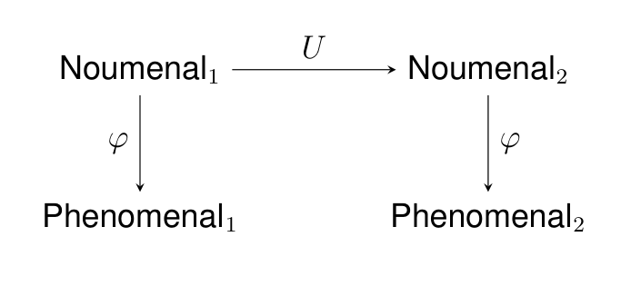
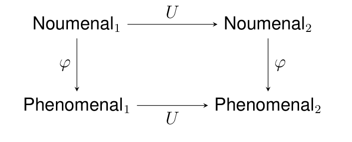
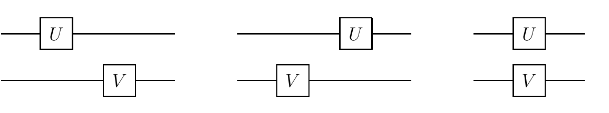
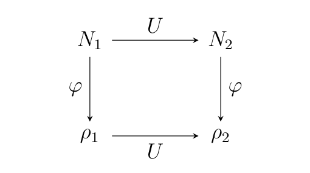
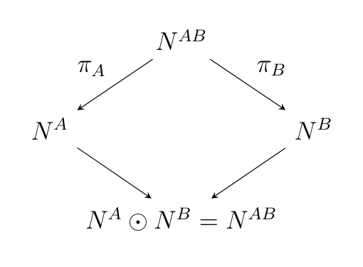
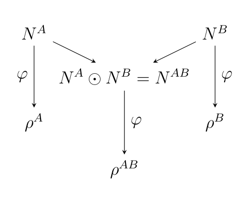
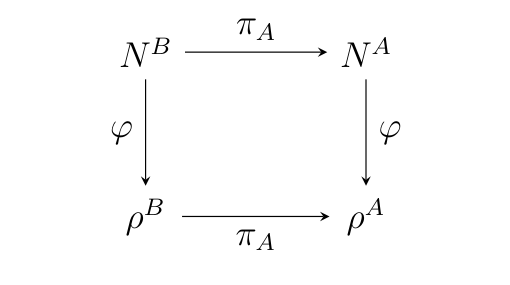
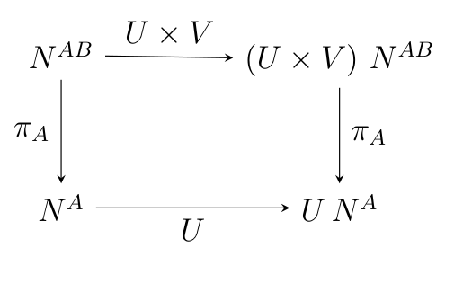
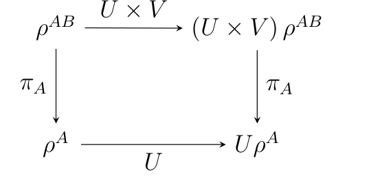

# The equivalence of local-realistic and no-signalling theories

**Paul Raymond-Robichaud**  
ISI Foundation, Turin, Italy  
`paul.r.robichaud@gmail.com`

*arXiv:1710.01380v2 [quant-ph], 4 February 2021*  
*Manuscript date: February 5, 2021*

## Abstract

> We provide a framework that describe all local-realistic theories and all no-signalling theories. We show that every local-realistic theory is a no-signalling theory. We also show that every no-signalling theory with invertible dynamics has a local-realistic model. This applies in particular to unitary quantum theory.

> **Title-page note.** Gilles Brassard was an author of the first version of this paper. Indeed, he improved tremendously the presentation of the ideas and participated in innumerable discussions with the author. Nevertheless, he retrospectively felt it was unfair to have been an author, especially the first author, given that many people falsely attributed the work and the ideas to him, while he was the voice of this work rather than its creator. He proposed to withdraw from the article in order to let his student shine and ensure proper attribution to the ideas. I assured him that he could remain as a second author, but this was not an option for him because, as he had already explained to me years earlier, alphabetical order for authors' names is customary in his fields, and he has followed it strictly throughout his career. Thus, he could have been an author and he continues to endorse with enthusiasm the ideas presented here. I dedicate this paper to him and his invaluable friendship, since this work would not have been possible without him.

> **Conversion note.** This Markdown edition is a structural conversion of the supplied 62-page PDF. Running page numbers are omitted. Mathematical notation is preserved as text using Markdown math delimiters where possible. The paper's embedded commuting diagrams and circuit sketches are cropped into `images/` and placed at their corresponding locations.

## Acknowledgements

My deepest gratitude goes to Gilles Brassard, who could have been an author of this paper and whose role was explained in the title page footnote.

I am grateful to David Deutsch for countless stimulating discussions and for providing numerous suggestions for improvement to a draft of this article.

I acknowledge stimulating discussions with Stefan Wolf, Renato Renner, Sandu Popescu, Marcin Pawłowski, Dominic Mayers, Chiara Marletto, St´ephane Durand, Giulio Chiribella, Jeff Bub, Michel Boyer, Charles Bennett, and Charles Alexandre B´edard.

This work has been supported in part by the Natural Sciences and Engineering Research Council of Canada, the Fonds de recherche du Qu´ebec - Nature et technologies and from Intesa Sanpaolo Innovation Center. The funders had no role in study design, data collection, and analysis, decision to publish, or preparation of the manuscript.

## 1. Introduction

This article presents original formal axioms defining local-realistic theories and no-signalling theories. These axioms attempt to be the most general possible and are required to prove formally any result that apply to all local-realistic theories and all no-signalling theories.

The axioms are formulated without any reference to interpretations of the theory. However, the interpretation with which a given no-signalling theory is presented may include additional statements beyond its strict formalism, which once properly formalized might be inconsistent with the axioms of local-realism or with a particular local-realistic model of it. Thus, while the axioms of local-realism do not make assumptions regarding the interpretation of a given theory, their supposition nevertheless rules out interpretations of it.

This is in sharp contrast with the local-hidden variable formulation of local-realism introduced by Bell [1]. This formulation implicitely add interpretative assumptions beyond the notion of local-realism [4, 6]. Whenever a theory has a local-realistic model that cannot be described by local-hidden variables, this merely prove that the model is incompatible with these extraneous assumptions.

The simplest example of such a theory is the non-local box, introduced by Popescu and Rorhlich, which has a local-realistic interpretation and yet cannot be described by local-hidden variables [3, 4, 16, 17]. The most interesting example is certainly quantum theory, since it is the current theory of Nature, and David Deutsch and Patrick Hayden have proven that it has a local-realistic model, despite all its seemingly non-local features like entanglement [6, 18].

Once the notion of local-realistic theories and no-signalling theories is properly axiomatised, we shall see that every local-realistic theory is trivially also a no-signalling theory. The reason is that the defining property of a no-signalling theory is that no action on a system can have any observable effect on a separated system, while a key property of a local-realistic theory is that no action on a system can have any effect whatsover on a separated system.

Conversely, we shall then prove that under very minor postulates any given invertible-dynamics no-signalling theory has a local-realistic model. The proof of this fact emerged from the construction of a rigorous local-realistic model for quantum theory and from a formalization of the concept of local-realism independent of quantum theory [18]. Once this was done, it soon appeared that the principles defining local-realistic theories and the core ideas involved in the creation of a local-realistic model for quantum theory could be used to create a local-realistic model for an arbitrary no-signalling theory with invertible dynamics.

Thus, this paper shares many ideas of the previous companion paper [18], including the same informal principles of local-realism, the same framework for local-realistic theories, except for the omission of Axiom 3.7, which was not essential and for the projection axioms (Axioms 3.9 and 3.10), which were previous presented in term of traces. Also, the theorems and proofs presented here emerged from previous theorems and proofs. However, in the current paper, quantum theory is viewed as a theory among many, and our sole interest in it is to show that it satisfies the formal requirements of a no-signalling theory with invertible dynamics, and thus that the construction presented here applies to it. Moreover, we shall discuss the philosophical aspects of local-realism and the axioms of local-realistic theories in much greater detail and without specific reference to quantum theory and finally various theorems that were not needed or proved in the previous paper are proved here.

All the key ideas in the current paper were presented in a chapter of the thesis of the author, performed under the supervision of Gilles Brassard [19]. However, contrarily to this previous presentation, here local realistic theories and no-signalling theories are described through explicit axioms, and the hypotheses used to proved the main result are described by explicit postulates. Equally the material in the appendices is new. Finally, for reasons of concision the material in the thesis on how the axioms of local-realism could be extended to deal with aspects concerning infinitely many systems has been omitted.

## 2. Conceptual foundations of local-realism

Before stating the axioms that characterize a local-realistic theory, it would be useful to investigate the concept of realism and local-realism in order to motivate some mathematical properties that will be explained rigorously later. But first, what is realism?

Realism is the idea that their exists a world outside of our immediate subjective experience and that the state of this world determines the outcome of all observations.

### 2.1. Appearance vs reality

This outside world can be called the real world, the external world, the objective world, or in Kant's terminology: the noumenal world [7, 11]. It describes the world as it is rather than the world as it can observed, or known through sensory experience.

According to realism, our subjective experience, our perceptions, our sense-data, are determined by the state of the external world. The portion of the real world that is observable or perceptible is called the perceptive world, or alternatively the observable world, or in Kant's terminology: the phenomenal world.

Kant's terminology shall be followed for the remainder of the article. However this should neither be taken as endorsement of Kant's metaphysics nor as claim that the terms are employed in the same way.

To be perceptible does not mean to be perceived directly. If we scan a molecule with an atomic force microscope, the properties thus observed are perceptible even though we are not observing the molecule directly with our naked eyes. The only limit to what kind of measurement device may be used to determine what is perceptible are the laws of Nature, not merely the currently available technology.

Also, to be perceptible does not imply to be perceived right now by some observer. For instance, the far side of the Moon existed as part of the phenomenal world even before we had the technology that allowed us to observe it. Thus, we include as part of the perceptible world, not what is perceived now, but rather potential perceptions.

What is the relation between the noumenal world and the phenomenal world? What is perceptible must follow a process parallel to what exists. As the noumenal world evolves, so does the phenomenal world. Any property that exists in the phenomenal world arises from a property in the noumenal world.

We can represent the relation between the noumenal and the phenomenal worlds with the following diagram.

*Diagram: relation between noumenal and phenomenal states.*

Here, ϕ is a mapping that determines the state of the phenomenal world in function of the state of the noumenal world. We refer to a state of the noumenal world as a noumenal state and to a state of the phenomenal world as a phenomenal state. Any phenomenal state arises from at least one noumenal state. Thus ϕ is surjective.

The left part of the picture illustrates the following idea: when the noumenal world is in state Noumenal1, it has a corresponding phenomenal state Phenomenal1, which is determined by applying ϕ to Noumenal1:

$$
Phenomenal1 = ϕ(Noumenal1).
$$

The Law of Nature that determines the evolution of the noumenal world is represented by U in this diagram. The world is made of systems that may or may not interact with each other. A system is open when its evolution can affect the rest of the universe, and closed when it does not. When it is closed, nothing from the system can escape to the environment.

Consequently, we can think of U as a transformation that takes as input a noumenal state and outputs a new noumenal state. This makes sense for the whole

universe as well as for any closed system. In the latter case, the precise transformation applied would depend on various factors including time and the state of the environment, which is the part of the universe external to the closed system.

The upper part of the picture illustrates the following fact: if we apply a transformation U to a closed system that was in state Noumenal1, the new state of the system, Noumenal2, is determined only by its previous state and the transformation. This can be summarized in the following equation:

$$
Noumenal2 = U ⋆Noumenal1.
$$

Note that we wrote "U ⋆Noumenal" above, rather than the more familiar form "U(Noumenal)", because we should not think here of U as a function, but rather "⋆" is an action and U acts on the noumenal state according to that action. This allows us to use the same U to act differently on noumenal and phenomenal states by invoking different actions.

Finally, in the right part of the picture, we see that from the new noumenal state, Noumenal2, corresponds a phenomenal state, Phenomenal2. Mathematically: Phenomenal2 = ϕ(Noumenal2).

### 2.2. Parallel process between noumenal and phenomenal worlds

A question arises naturally when considering a closed system: is it possible to describe its phenomenal evolution without having recourse to the noumenal world? Could we explain the evolution of phenomenal states only in terms of phenomenal states and transformations applied on them? Could we explain the evolution of state Phenomenal1 to state Phenomenal2 through transformation U, without invoking the underling state Noumenal1 giving rise to state Noumenal2?

Mathematically, can the following equation be well-defined:

$$
Phenomenal2 = U · Phenomenal1,
$$

where we have used "·" to distinguish this action from the one on noumenal states, which was denoted "⋆" above? We now argue that the answer is yes.

The equation will be well-defined whenever any two possibly distinct underlying noumenal states Noumenal1 and Noumenal* 1 giving rise to the same state Phenomenal1 must also give rise to the same phenomenal states after evolution

through the transformation U. We now argue that this will be the case. Suppose we have two states Noumenal1 and Noumenal* 1 giving rise to the same phenomenal state Phemonenal1. This means that these noumenal states are completely indistinguishable by any experiment whatsoever. This would include experiments that start by applying transformation U. It follows that states Noumenal2 = U ⋆Noumenal1 and Noumenal* 2 = U ⋆Noumenal* 1 must also be indistinguishable, and therefore they cannot give rise to distinct phenomenal states.

Thus, a state Phenomenal1, on which a transformation U is applied, will evolve to a well-defined state Phenomenal2. Hence, we can write:

$$
Phenomenal2 = U · Phenomenal1.
$$

It follows that there are two ways in which the same state Phenomenal2 can be reached from Noumenal1.

• We can apply first transformation U to Noumenal1 to obtain Noumenal2 and then apply function ϕ to Noumenal2 and determine Phenomenal2;

• or we could apply first ϕ to Noumenal1 to determine Phenomenal1 and then we apply U to Phenomenal1 to obtain Phenomenal2.

This allows us to update our diagram to illustrate the parallel process between the evolution of the noumenal world and the phenomenal world:

*Diagram: parallel process between noumenal and phenomenal evolution.*

This commuting diagram states that the evolution of the phenomenal consequences of the noumenal world are the phenomenal consequences of the evolution of the noumenal world.

Mathematically ϕ is a homomorphism that verifies:

$$
ϕ(U ⋆Noumenal1) = U · ϕ(Noumenal1).
$$

The evolution of the phenomenal world is an epiphenomenon: Understanding how the noumenal world evolves and the relation between the noumenal world and the phenomenal world is sufficient to describe the evolution of the phenomenal world.

### 2.3. Leibniz's Principle

The previous discussion was made necessary by the possibility of two different noumenal states that can give rise to the same phenomenal state. This possibility runs against a principle attributed to Leibniz [8, 12], which claims that if there is no possible perceptible difference between two objects, then these objects are the same, not superficially, but fundamentally. This would imply that if two phenomenal states are equal, then they must arise from the same noumenal state and hence that ϕ is injective. As seen previously homomorphism ϕ is surjective, thus ϕ would be an isomorphism between the noumenal world and the phenomenal world. Given that an isomorphism is a mere rebranding of terms, the noumenal-phenomenal distinction would be unnecessary since it would provide no additional explanatory power. However, it can be proven that there are no local-realistic models of quantum theory that satisfy Leibniz's principle[18].

### 2.4. Principles of Local-Realism

Now that we have discussed the nature of realism we turn toward the nature of local-realism. Intuitively, a local-realism can be described by the following principles:

Principles of Local Realism

1. There is a real world which consists of various parts, called systems.

2. A system may be decomposed into subsystems.

3. Every system is a subsystem of the global system consisting of the entire world.

4. At any given time, each system is in some state.

5. The state of a system determines, and is determined by, the state of its subsystems.

6. What is observable in a system is determined by the state of the system.

7. The state of the world evolves according to some law.

8. The evolution of the state of a system can only be influenced by the state of systems in its local neighbourhood.

The notion of local neighbourhood depends on the underlying physics. In the case of relativity theory, this would mean that no systems can influence each others if they are space-like separated. This implies that no action on a system can have an influence on another system at a speed faster than light. However, these principles are not restricted to theories in which general relativity holds.

### 2.5. Separation beyond relativity theory

One main lesson of the shift from Newtonian space-time to relativity is this: there exists events that are not causally related to one another. Provided Alice and Bob are space-like separated, it does not matter whether Alice act before Bob in a certain reference frame or Bob act before Alice in another one. This is true because in reality, neither is acting before the other and neither is influencing the other in the slightest way. A generalized characterization of local-realistic theories beyond relativity must be able to incorporate these ideas without reference to the speed of light.

In a local-realistic theory, provided systems A and B are sufficiently far apart, it should not matter if we perform operation U first on system A and nothing on system B, followed by nothing on system A and V on system B, or if first we do nothing on system A and V on system B, followed by U on system A and nothing on system B. In either case, this simply corresponds to performing U on A and V on B. This is illustrated by the following three circuits, inspired by quantum computational networks [5], whose effect is identical.

*Diagram: three equivalent separated circuits for operations U and V.*

Simply put, it is not meaningful to say that U was done before V or vice versa. In a local-realistic theory, one key property is that the state of system A should only change when operation U is done to it, independently of whether operation V was done or not on system B.

## 3. Local-realistic theories

### 3.1. Axioms and models

The concept of a local-realistic theory will soon be formalized according to the principles enumerated of section 2.4. This will be done through the creation of an explicit axiomatic system that characterize the notion of a local-realistic theory.

Intuitively, an axiomatic system is simply a list of mathematical propositions called axioms expressed in the language of predicate logic. Here, for ease of reading, the axiomatic system of local-realistic theories and no-signalling theories is expressed through the use of English supplemented by some mathematical symbols, rather than in the recondite language of quantifiers, logical connective and predicates. A mathematical proposition in an axiomatic system also contains various mathematical symbols that do not refer to a specific mathematical-objects. For example, the axioms of local-realistic theories contain symbols like "πB A" or "Noumenal-SpaceA" and the axioms do not tell us to what objects these symbols refer to. A model of an axiomatic system is an assignment to every such mathematical symbol to a specific mathematical object, in such a way that all the axioms are true. Formal definitions of axiomatic system and model are given in ref.[10].

A mathematical theory is defined as local-realistic if it satisfies all the axioms of local-realistic theories that shall be presented here. In contrast, a physical theory should not be seen as a purely mathematical theory, since it also contains non-mathematical entities related to its interpretation and to other factors. The precise question of when a physical theory should be considered local-realistic shall be discussed in the conclusion of this paper.

### 3.2. Systems

We want to define the mathematical properties of systems, where systems describe meaningful parts of the world. These systems can be combined in various way to give rise to different systems. For example, if A is a system, there will be a system A, the complement of system A, consisting of the rest of the world. As an other example, if A and B are systems, there will be a system A ⊔B, the union of system A and B consisting of the parts of the world consisting of the part of the world belonging to either of the two systems A and B.

Mathematically, systems will be represented as elements of a lattice of systems, which we define now.

**Definition 3.1 (Lattice of systems).** A lattice of systems is a 6-tuple (S, ⊔, ⊓, ·, S, 0), where S is a set of elements called systems.

There are two special systems:

1. S, which is the whole system being considered, hereinafter called the global system. It could be the entire universe. Alternatively, it could be something much smaller, like a quantum computer or a single photon.

2. The empty system 0, which contains no parts at all.

Let A and B be systems, then:

1. There exists a system A ⊔B, the union of A and B.

2. There exists a system A ⊓B the intersection of A and B.

3. There exists a system A, the complement of A, which is defined so that A ⊓A = 0 and A ⊔A = S. Intuitively, it is composed of all the parts of S that are not in A.

The transformations (⊔, ⊓, ·) and distinguished elements (S, 0) behave like their usual set-theoretic counterparts. We use the slightly different notation of ⊔, ⊓, rather than ∪, ∩, to emphasize the fact that the transformations ⊔and ⊓are purely algebraic in nature. Formally, a lattice of systems is a boolean lattice.

Given the definition of a lattice of systems, we can state the first axiom.

**Axiom 3.1 (Systems).** Associated to a local-realistic theory is a lattice of systems (S, ⊔, ⊓, ·, S, 0).

We now introduce some terminology on systems.

**Definition 3.2 (Subsystem).** System A is a subsystem of a system B, written A ⊑B, if A ⊓B = A.

**Definition 3.3 (Disjoint systems).** Systems A and B are disjoint if they have no parts in common, i.e. A ⊓B = 0.

Note that the empty system is a subsystem of all systems, including itself, and that it is disjoint from all systems, again including itself.

**Definition 3.4 (Composite system).** Let A and B be disjoint. The system A⊔B is a composite system, composed of systems A and B. For convenience, we denote it by AB, rather than A ⊔B.

Since ⊔is commutative, we have that AB = A ⊔B = B ⊔A = BA.

Since ⊔is also associative, we have A (BC) = (AB) C for any three mutually disjoint systems A, B and C. Thus, we shall simply write ABC to denote the composite system consisting of A, B and C.

### 3.3. States

We follow Kant's terminology [7, 11], and thus we distinguish two kinds of states in a system, as mentioned informally in Section 2.1.

Noumenal State: The noumenal state of a system is its complete description. It describes the system as it is, rather than what can be observed about it, or known through sensory experience. It describes not only what can be observed from a system, but also how the system can interact with other systems. It is a state of being. It describes the system in itself, including parts that are not observable locally or at all. Another term used in quantum foundations literature to describe the noumenal state would be the ontic state [20].

Phenomenal State: The phenomenal state of a system is a complete description of what is locally observable in that system. The phenomenal state is a complete description of all the observable properties potentially accessible in a system. It is what is observable in a system; not what is actually observed. The phenomenal state contains everything that can be observed through arbitrarily powerful technology. The only restriction on the technology is that it must abide by the laws of Nature.

The choice of terminology reflects the difference between appearance and reality. An alternative distinction, which is somewhat orthogonal, concerns the difference between existence and knowledge. The theories of existence and of knowledge are dealt with in the respective branches of philosophy called ontology and epistemology. Following that path would have led to the distinction between the ontic state of a system and its epistemic state [20]. The ontic state corresponds to what we have called the noumenal state. However, the epistemic state corresponds to what is known about a system by some observer [13], which might be subjective and vary from one observer to another [9, 14]. It should be emphasized that our phenomenal states are not states of knowledge, neither are they relative to an observer. Hence, epistemic and phenomenal states are two fundamentally different notions.

This leads us to corresponding axioms:

**Axiom 3.2 (Noumenal state space).** Associated to a system A is noumenal state space, Noumenal-SpaceA, which is a non-empty set of noumenal states.

Particular noumenal states of A will be denoted NA, NA i, NA 1, etc.

Intuitively, the noumenal state space of a system consists of all possible noumenal states that it could theoretically be in.

**Axiom 3.3 (Phenomenal state space).** Associated to a system A is a phenomenal state space, Phenomenal-SpaceA, which is a non-empty set of phenomenal states.

Particular phenomenal states of A will be denoted ρA, ρA i, ρA 1, etc.

Intuitively, the phenomenal state space of a systems consist of all possible phenomenal state that it could theoretically be in.

### 3.4. Transformations and actions

We now want to describe how states can evolve in a local-realistic theory. The evolution of a system happens through transformations that can be applied to the system. The precise transformation that is applied might depend on: the environment external to the global system which might be empty if the global system is the whole universe, on the dynamical laws of physics; or on time and other variables.

The next definition characterizes the mathematical properties of a set of transformations and how these transformations may be combined into to new transformations.

**Definition 3.5 (Monoid of transformations).** A monoid of transformations is a 3- tuple (Transformations, ◦, I), where Transformations is a set whose elements are called transformations. The set of transformations comes with a binary operator denoted "◦", called the composition, and I is a transformation called the identity transformation. A monoid of transformations satisfies the following properties:

1. If U and V are transformations, U ◦V is a transformation called the composite of U and V;

2. If U, V and W are transformations, U ◦(V ◦W) = (U ◦V) ◦W;

3. For all transformations U,

$$
I ◦U = U ◦I = U.
$$

Importantly, any transformation that might be physically applied to a system must belong to the set of transformations associated to that system, but the converse might not hold. In quantum theory, the transformations associated to a system consist of the unitary operations of the Hilbert space associated to that system, but the transformations physically possible might be further restricted by other considerations. For example when working in quantum computing, we might declare that only unitary operations that are finitely generated by the composition of a certain set of quantum gates are physically realizable, while other unitary operations are merely meaningful mathematical transformations.

When there is no ambiguity, we shall omit the composition operator and write UV instead of U ◦V.

When the transformations in a monoid are invertible, they define a group of transformations as follows.

**Definition 3.6 (Group of transformations).** A monoid of transformation (Transformations, ◦, I) is a group of transformation if associated to every transformation U in Transformations there exist a transformation V, the inverse of U, which has the property that U V = V U = I.

In a group of transformation, the inverse of a transformation U is unique and will be denoted U−1.

Now:

**Axiom 3.4 (Transformations on a system).** Associated to a system A is a monoid of transformations, (TransformationsA, ◦A, IA).

Particular transformations on system A are denoted UA, V A, etc. Also, IA

denotes the identity transformation on system A. When there is no ambiguity, we drop the superscript and write simply U, V and I.

Intuitively, the transformations associated to a system are the transformations that can be performed on the system, and if U and V are transformations on a system, the transformation U ◦V can be implemented by first doing V, followed by doing U.

A transformation can act on a state to produce a new state, as follows:

**Definition 3.7 (Action).** Let (Transformations, ◦, I) be a monoid of transformations and S be a set. An action of the monoid of transformation on set S is a binary operator ⋆: Transformations × S →S that satisfies, for all transformations U and V and for all element s of the set S,

1. U ⋆(V ⋆s) = (UV) ⋆s;

2. I ⋆s = s.

The next two axioms use the above definitions to express the fact that a transformation done on a system changes its underlying noumenal and phenomenal state.

**Axiom 3.5 (Noumenal action).** Associated to a system A, is a noumenal action denoted "⋆A", which is an action of the monoid of transformations of the system on the set of noumenal states of the system.

When there is no ambiguity, we drop the superscript of the noumenal action. For example, we write U ⋆NA instead of U ⋆A NA.

Intuitively, if system A was in noumenal state NA, and a transformation U is done on it, its new noumenal state is U ⋆NA.

**Axiom 3.6 (Phenomenal action).** Associated to a system A, is a phenomenal action "·A", which is an action of the monoid of transformations of the system on the set of phenomenal states of the system.

When there is no ambiguity, we drop the superscript of the phenomenal action. For example, we write U · ρA instead of U ·A ρA.

Intuitively, if a system A was in phenomenal state ρA, and a transformation U is done on system A, its new phenomenal state is U · ρA.

Sometimes, transformations can be characterized precisely in terms of how they act on a given set. This leads to the concept of a faithful action.

**Definition 3.8 (Faithful action).** Let ⋆be an action of a monoid of transformations on a set S. The action is faithful if transformations U and V are equal whenever U ⋆s is equal to V ⋆s for every element s of S. Thus, the action is faithful if whenever two transformations act identically on all elements of S they are equal.

The next axiom states that if two transformations act identically all noumenal states, then they are equal.

**Axiom 3.7 (Noumenal faithfulness).** For every system, its associated noumenal action is faithful.

It is both algebraically very useful and physically natural to impose noumenal faithfulness. However, this axiom is not fundamental because any theory that verifies all axioms of local-realism except this one can be transformed into a noumenally faithful local-realistic theory by replacing transformations by equivalence classes of transformations, in effect equating any two transformations that act identically on all possible noumenal states. For details, see appendix A.

### 3.5. Noumenal-phenomenal homomorphism

In a local-realistic theory, what is observable locally in a system is determined by the complete description of that system, in other words, the noumenal state

of a system determines its phenomenal state. If the noumenal state of a system evolves according to a transformation, its corresponding phenomenal state must evolve according to the same transformation. Mathematically the phenomenal state of a system will be determined by its underlying noumenal state, through a structure-preserving surjective map - a noumenal-phenomenal epimorphism. But first:

**Definition 3.9 (Noumenal-phenomenal homomorphism).** Let A be a system and let φ be a mapping whose domain is the noumenal state space of A and whose range is the phenomenal state space of A. We say that φ is a noumenal-phenomenal homomorphism on system A if, for any transformation U of system A and any noumenal state N of A,

$$
φ(U ⋆N) = U · φ(N).
$$

When no ambiguity can arise, we omit the actions. For example, the equation above becomes φ(UN) = U φ(N).

**Definition 3.10 (Noumenal-phenomenal epimorphism).** A surjective noumenal-phenomenal homomorphism on system A is called a noumenal-phenomenal epimorphism on system A.

**Axiom 3.8 (Noumenal-phenomenal epimorphism).** Associated with each system A is a noumenal-phenomenal epimorphism denoted ϕA called the noumenal-phenomenal epimorphism of system A.

When there is no ambiguity, we write ϕ instead of ϕA.

Intuitively, if a system A is in noumenal state NA, it has a corresponding phenomenal state ρA = ϕ(NA). Furthermore, if a transformation U is done on system A, its new noumenal state is UNA, and its corresponding new phenomenal state is UρA. Lastly, every phenomenal state on a system arises from at least one noumenal state, since what is observable has an underlying reality.

The transformations act in a way that leads to the parallel evolution of the noumenal world and the phenomenal world, as explained intuitively in Section 2.2. This is best illustrated by the commuting diagram that we had seen previously:

*Diagram: homomorphism commuting square.*

### 3.6. Splitting and merging

As we explained informally in Section 2.4, a local-realistic world can be decomposed into several parts. These parts exist in such a way that the state of the whole determines the state of the parts, and conversely the state of the whole is fully determined by the state of the parts. Note that the latter is not the case with the standard description of quantum theory since entangled states cannot be recovered from the state of their subsystems. This is the reason why the usual formalism does not provide a local-realistic model of quantum theory.

Given a composite system AB, its noumenal state NAB can be decomposed in two states: A noumenal state NA, in the state space of A, and a noumenal state NB, in the state space of B. Informally, the state of the parts is determined by the state of the whole. For this purpose, we shall introduce formally with Axiom 3.9 two projectors, πA and πB, which split a system in the following way:

$$
NA = πA
(NAB)
and NB = πB
(NAB).
$$

Furthermore, the two noumenal states NA and NB determine completely the noumenal state NAB. Informally, the state of the whole is determined by the state of the parts. For this purpose, we shall introduce formally with Axiom 3.12 a noumenal product "⊙", which merges the noumenal states of systems A and B as follows: NAB = NA ⊙NB.

This is illustrated by the following diagram.

*Diagram: splitting and merging noumenal states.*

Note that such a diagram would not be possible at the phenomenal level in quantum theory, if we replaced N by ρ throughout. Nevertheless, even though the phenomenal state ρAB of composite system AB cannot be determined from the phenomenal states ρA and ρB of subsystems A and B, it can be determined (as well as ρA and ρB) from the noumenal states NA and NB of A and B, as illustrated by the following diagram.

*Diagram: phenomenal states arising from noumenal states.*

#### 3.6.1. Noumenal and phenomenal projectors

Let us now proceed formally.

The next axioms express the fact that the noumenal state of a system determines the noumenal state of any of its subsystems.

**Axiom 3.9 (Noumenal projector).** Associated to all systems A and B such that A is a subsystem of B, is a function denoted πB A, which is called the noumenal projector from system B to system A. Projector πB A is a surjective function from the noumenal space of system B to the noumenal space of system A.

Furthermore, for all systems A, B and C, where A is a subsystem of B, which is itself a subsystem of C then the following relation hold between projectors:

$$
πB
A ◦πC
B = πC
A,
$$

where ◦denotes the composition of functions.

When there is no ambiguity, we shall omit the superscript and we shall refer to πA as the noumenal projector to system A, regardless of the supersystem from which it is projected. For example, the previous equation will simply be written as: πA ◦πB = πA.

Intuitively if a system B is in noumenal state NB, the noumenal state of a subsystem A will be NA = πA(NB).

The next axiom expresses the fact that the phenomenal state of a system determines the phenomenal state of any of its subsystems.

**Axiom 3.10 (Phenomenal projector).** Associated to all systems A and B such that A is a subsystem of B, is a function called the phenomenal projector from system B to system A. These phenomenal projectors follow the same requirements as noumenal projectors, as stated in axiom 3.9, mutatis mutandis. As an abuse of notation, we also denote the phenomenal projectors from system B to system A by πB A, since no ambiguity will be possible with the corresponding noumenal projector πB A.

Finally, when there is no ambiguity, we shall omit the superscript and we shall refer to πA as the phenomenal projector to system A, regardless of the supersystem from which it is projected.

Intuitively if a system B is in phenomenal state ρB, the noumenal state of a subsystem A will be ρA = πA(ρB).

Projectors are idempotent 1 under composition, i.e.:

$$
πA ◦πA = πA.
$$

This lead to the following two theorems.

1 By definition, x is idempotent under operation "·" when x · x = x.

**Theorem 3.1.** For any noumenal state NA of system A,

$$
πA
(NA)
= NA.
$$

*Proof.* The surjectivity of πA A implies that there must exist a state NA α in the noumenal space of system A such that πA (NA α) = NA. Therefore,

$$
πA
(NA)
= πA(πA(NA
α)) = (πA ◦πA)
(NA
α)
= πA
(NA
α)
= NA.
$$

Of course, this NA α is none other than the original NA since πA (NA α) = NA by definition of NA α, but also πA (NA α) = NA α by the theorem itself.

**Theorem 3.2.** For any phenomenal state ρA of system A,

$$
πA
(ρA)
= ρA.
$$

*Proof.* The proof is left to the reader.

The next axiom expresses the consistency between the noumenal and phenomenal projectors.

**Axiom 3.11 (Relation between noumenal and phenomenal projectors).** For all systems A and B such that A is a subsystem of B, and all noumenal states NB, the noumenal and phenomenal projections to system A are related by the following commuting relation: πA (ϕ (NB)) = ϕ (πA (NB)).

Here the symbol ϕ stands for ϕAB on the left side of the equation, but for ϕA on the right side. Also the symbol πA stands for the phenomenal projection on the left side of the equation, but for the noumenal projection on the right side.

The relation between the noumenal and phenomenal projectors is best visualized by the fact that the following diagram commutes.

*Diagram: relation between noumenal and phenomenal projectors.*

#### 3.6.2. Abstract trace

Quantum theory often mentions tracing out other systems. More generally, we can define an abstract trace from any projector. For all disjoint systems A and B, for all noumenal states NAB and all phenomenal states ρAB, we define

$$
trB
(NAB) def
= πA
(NAB)
and trB
(ρAB) def
= πA
(ρAB).
$$

Again, while both traces are different functions, they will be denoted with the same symbols since no ambiguity can arise. The choice of working with projectors rather than traces stems from the fact that the notion of trace belongs to linear algebra only, whereas projectors are universal mathematical objects.

#### 3.6.3. Noumenal Product

We shall need the following definition to express the next axiom.

**Definition 3.11 (Compatible states).** Let AB be a composite system, let NA and NB be noumenal states of system A and B respectively. We say that NA and NB

are compatible states if there exist a noumenal state NAB of system AB such that NA = trB(NAB) and NB = trA(NAB).

The next axiom expresses the requirement that the state of a system is determined by the state of its subsystems.

**Axiom 3.12 (Noumenal product).** Associated to all pair of disjoint systems A and B is a transformation, the noumenal product, denoted "⊙A,B", such that for all noumenal states NAB of AB, the following equation holds:

$$
NAB = πA
(NAB)
⊙A,B πB
(NAB).
$$

Furthermore, NA ⊙NB is defined only if states NA and NB are compatible.

When there is no ambiguity, we shall drop the subscript from the noumenal product and write simply ⊙instead of ⊙A,B.

There is no corresponding axiom for a phenomenal product, and this is the most profound distinction between the noumenal and phenomenal level.

**Theorem 3.3.** When NA and NB are compatible:

$$
πA(NA ⊙NB) = NA
$$

and πB(NA ⊙NB) = NB

*Proof.* We shall prove that πA(NA ⊙NB) = NA, the other statement is similar. Given that NA and NB are compatible, there exist a noumenal NAB of system AB such that πA(NAB) = NA and πB(NAB) = NB. It follows from the axiom of the noumenal product that

πA(NA ⊙NB) = πA(πA(NAB) ⊙πB(NAB)) = πA(NAB) = NA.

**Theorem 3.4.** Let AB be a composite system, let NA, NB and NAB be noumenal states of systems A, B and AB, respectively.

$$
NA ⊙NB = NAB
$$

⇐⇒

$$
NA = πA(NAB) and NB = πB(NAB)
$$

*Proof.* This theorem follows directly from Theorem 3.3 and Axiom 3.12.

It follows from Theorem 3.4 that for an arbitrary noumenal state NAB of composite system AB, there exist a unique noumenal state NA of A and a unique noumenal state NB of B such that NAB = NA ⊙NB. Of course, these states are respectively πA(NAB) and πB(NAB).

**Theorem 3.5 (Commutativity of the noumenal product).** For any disjoint systems A and B, NA ⊙(A,B) NB = NB ⊙(B,A) NA.

*Proof.* (NA ⊙(A,B) NB)

$$
= πB(NA ⊙(A,B) NB) ⊙(B,A) πA(NA ⊙(A,B) NB)
$$

$$
= NB ⊙(B,A) NA.
$$

We are now interested in showing that the noumenal product is associative, as demonstrated by Theorem 3.6. To do we shall need the four following lemmas.

**Lemma 3.1.** Let NA, NB and NC be noumenal states of systems A, B and C respectively such that the product NABC = (NA ⊙NB) ⊙NC is defined. The following hold

NAπA(NABC) and NB = πB(NABC) and NC = πC(NABC).

*Proof.* We shall prove that NA is equal to πA(NABC), the other statements are similar and left to the reader.

$$
NA = πA(NA ⊙NB)
$$

$$
= πA(πAB((NA ⊙NB) ⊙NC))
$$

$$
= πA(πAB(NABC))
$$

$$
= πA(NABC)
$$

**Lemma 3.2.** Let NA, NB and NC be noumenal states of systems A, B and C respectively such that the product NABC = NA ⊙(NB) ⊙NC) is defined. The following hold

NA = πA(NABC) and NB = πB(NABC) and NC = πC(NABC).

*Proof.* The proof is similar to Lemma 3.1 and is left to the reader.

**Lemma 3.3.** Let NABC be a noumental state of composite system ABC, then

$$
πA(NABC) ⊙πB(NABC) = πAB(NABC).
$$

*Proof.* 

$$
πA(NABC) ⊙πB(NABC)
$$

$$
=(πA ◦πAB)(NABC) ⊙(πB ◦πAB)(NABC)
$$

$$
=(πA(πAB(NABC)) ⊙πB(πAB(NABC))
$$

$$
=πAB(NABC).
$$

**Lemma 3.4.** Let NABC be a noumenal state of composite system ABC, let NA = πA(NABC), NB = πB(NABC), NC = πC(NABC). The following hold:

$$
(NA ⊙NB) ⊙NC = NABC = NA ⊙(NB ⊙NC).
$$

*Proof.* Importantly by Lemmas 3.1 and 3.2, both products (NA ⊙NB) ⊙NC and NA ⊙(NB ⊙NC) are defined.

We now show that (NA ⊙NB) ⊙NC is equal to NABC. We leave it to the reader to verify that NA ⊙(NB ⊙NC) is also equal to NABC. Using Lemma 3.3, we can see that

$$
(NA ⊙NB) ⊙NC
$$

$$
=(πA(NABC) ⊙πB(NABC)) ⊙πC(NABC)
$$

$$
=πAB(NABC) ⊙πC(NABC)
$$

$$
=NABC.
$$

**Theorem 3.6 (Associativity of the noumenal product).** Let ABC be a composite system, let NA, NB, NC be noumenal states of systems A, B and C respectively. The product (NA ⊙NB) ⊙NC is defined precisely when NA ⊙(NB ⊙NC) is defined, in which case, (NA ⊙NB) ⊙NC = NA ⊙ (NB ⊙NC).

*Proof.* The theorem follows immediately from Lemmas 3.1, 3.2 and 3.4.

It follows from the associativity of the noumenal product that we can omit unnecessary parentheses and write NA⊙NB⊙NC to denote the noumenal product of NA, NB and NC.

**Theorem 3.7.** Let NA, NB, NC and NABC be noumenal states of systems A, B, C and ABC, respectively. The product NA ⊙NB ⊙NC is defined and equal to NABC precisely whenever

NA = πA(NABC) and NB = πB(NABC) and NC = πC(NABC).

*Proof.* This theorem follows immediately from Lemmas 3.1 and 3.4.

It follows from Theorem 3.7 that for an arbitrary noumenal state NABC of composite system ABC, there exist unique noumenal states NA, NB and NC of respectively systems A, B and C such that NABC is equal to the product NA ⊙ NB ⊙NC. Of course, these states are respectively πA(NABC), πB(NAB) and πC(NABC).

### 3.7. Product of transformations

Intuitively, the next and last axiom of local-realitic theories tells us what happens to the noumenal state of composite system AB, if a transformation U is performed on system A and a transformation V is performed simultaneously on system B.

**Axiom 3.13 (Product of transformations).** Associated to all disjoint systems A and B, is a product of transformations, which we denote "×A,B". Given transformations U on system A and V on system B, U × V, the product of U and V, is a transformation on system AB that satisfies the following relation for any noumenal state NAB = NA ⊙NB: (U ×A,B V)(NA ⊙NB) = (UNA) ⊙(V NB).

When there is no ambiguity, we drop the subscripts and write simply × instead of ×A,B. Note that this equation defines U × V uniquely as the transformation satisfying the above equation because we had required the noumenal action to be faithful; see Definition 3.8. By using Theorem 3.3 on the equation above, it follows that

πA ((U × V) (NA ⊙NB)) = UNA and πB ((U × V) (NA ⊙NB)) = V NB.

Thus, the new state of system A is simply U NA, as it should. Crucially, we see that the transformation U performed on (possibly far-away) system A has had absolutely no effect on the noumenal state of system B.

This concept is illustrated by the following commuting diagram.

*Diagram: product of transformations.*

We now prove several properties of the product of transformations. These proofs hinge upon the fact that if two transformations act identically on all noumenal states, then they are the same transformation, by the faithfulness of the noumenal action (Axiom 3.7). Recall also that any state NAB can be represented as a product state NAB = NA ⊙NB and that the state NABC can be represented as a product NABC = NA ⊙ (NB ⊙NC) = (NA ⊙NB) ⊙NC.

**Theorem 3.8.** For any composite system AB, any transformations UA and V A on system A and any transformations UB and V B on system B, (UA × UB) (V A × V B) = (UAV A) × (UBV B)

*Proof.* Consider arbitrary compatible noumenal states NA and NB for systems A and B. ((UA × UB) (V A × V B)) (NA ⊙NB)

$$
=
(UA × UB) ((V A × V B) (NA ⊙NB))
$$

$$
=
(UA × UB) ((V ANA)
⊙
(V BNB))
$$

$$
=
(UA (V ANA))
⊙
(UB (V BNB))
$$

$$
=
((UAV A)
NA)
⊙
((UBV B)
NB)
$$

$$
=
((UAV A)
×
(UBV B)) (NA ⊙NB).
$$

It follows from noumenal faithfulness (Axiom 3.7) that ((UA × UB) (V A × V B))

is equal to ((UAV A) × (UBV B)).

**Theorem 3.9.** For any composite system AB,

$$
IA × IB = IAB
$$

*Proof.* Consider an arbitrary noumenal state NAB = NA ⊙NB on disjoint systems A and B. (IA × IB) (NA ⊙NB)

$$
= IA(NA)
⊙IA(NB)
$$

$$
= NA ⊙NB
$$

$$
= IAB(NA ⊙NB).
$$

It follows from noumenal faithfulness (Axiom 3.7) that IA × IB is equal with IAB.

**Theorem 3.10.** For any composite system AB, and any transformation U and V on systems A and B respectively,

$$
U ×A,B V = V ×B,A U
$$

*Proof.* Consider an arbitrary noumenal state NAB = NA ⊙A,B NB for system AB = BA.

$$
(U ×A,B V)
(NA ⊙A,B NB)
$$

$$
= (UNA) ⊙A,B (V NB)
$$

$$
= (V NB) ⊙B,A (UNA)
$$

$$
= (V ×B,A U)
(NB ⊙B,A NA)
$$

$$
= (V ×B,A U)
(NA ⊙A,B NB).
$$

It follows from noumenal faithfulness (Axiom 3.7) that (U ×A,B V) is equal with (V ×B,A U).

**Theorem 3.11.** For any composite system ABC, for any transformations U, V and W on systems A, B and C respectively,

$$
U × (V × W) = (U × V) × W.
$$

*Proof.* Consider an arbitrary noumenal state NABC = NA ⊙(NB ⊙NC) = (NA ⊙NB) ⊙NC for system ABC.

$$
(U × (V × W))
(NA ⊙(NB ⊙NC))
$$

$$
=
(UNA)
⊙
((V × W)
(NB ⊙NC))
$$

$$
=UNA ⊙
(V NB ⊙WNC)
$$

$$
=
(UNA ⊙V NB)
⊙WNC
$$

$$
=
((U × V)
(NA ⊙NB))
⊙WNC
$$

$$
= ((U × V) × W)
((NA ⊙NB) ⊙NC).
$$

It follows from noumenal faithfulness (Axiom 3.7) that (U × (V × W)) is equal to ((U × V) × W).

Since both ⊙and × are associative (Theorems 3.6 and 3.11), we can omit internal parentheses. For example,

$$
(U × V × W)
(NA ⊙NB ⊙NC)
= UNA ⊙V NB ⊙WNB.
$$

**Mathematical note.** The definition of product of transformation gives a direct product in the usual algebraic sense; Had we not required the noumenal action to be faithful, we could have had various pathologies. For instance, it could have happened that even though both IAB and IA × IB do nothing on any noumenal states, IA × IB is not the neutral element of the monoid, only an element of the kernel of the noumenal action, contradicting Theorem 3.9.

### 3.8. No-signalling principle

One important, albeit obvious, consequence of a theory being local-realistic is that it is not possible to send a signal from one system to another if there is no interaction between the two.

Intuitively, no transformation performed on some system A can have an instantaneous effect of any kind on a remote system B. It follows that no transformation performed on system A can have an instantaneous observable effect on system B. More precisely, when we perform a transformation U on system A and a transformation V on system B, transformation V has only affected the noumenal state of system B, without any influence on the noumenal state of system A. It follows that the phenomenal state of system A, which is a function of its noumenal state, is also unchanged. This is formalized in the following theorem.

**Theorem 3.12 (No-Signalling Principle).** Let ρAB be a phenomenal state of system AB. For all transformations U on system A and V on system B,

$$
πA
((U × V) ρAB)
= U πA(ρAB).
$$

We call the equation above the no-signalling principle because it means that no transformation V applied on system B can have a phenomenal (i.e. observable) effect on a remote system A.

*Proof.* Let NAB be any noumenal state such that ρAB = ϕ (NAB). Its existence is guaranteed from the surjectivity of ϕ.

$$
πA
((U × V) · ρAB)
$$

$$
= πA
((U × V) · ϕ
(NAB))
$$

$$
= πA
(ϕ
((U × V) ⋆NAB))
$$

$$
= ϕ
(πA
((U × V) ⋆NAB))
$$

$$
= ϕ
(U ⋆πA
(NAB))
$$

$$
= U · ϕ
(πA
(NAB))
$$

$$
= U · πA
(ϕ
(NAB))
$$

$$
= U · πA
(ρAB)
$$

Thus, a theory is no-signalling if the following diagram commutes.

*Diagram: no-signalling principle.*

Our statement of the no-signalling principle in Theorem 3.12 is a generalization of the usual notion, which is typically formulated in terms of the probability distribution of observation outcomes (which would be called measurements in quantum theory) made in two of more remote locations.

In the simplest bipartite instance, consider two observers Alice and Bob, who share some system AB. They dispose of sets of operations OperationsA that Alice can apply on A and OperationsB that Bob can apply on B. These operations may include observations that can produce outcomes x and y, respectively. Denote by ProbA[x|U] the probability that operation U applied by Alice on system A produces outcome x. Similarly, ProbAB[x, y|U × V ] is the joint probability that Alice observes x and Bob observes y if they perform operations U and V on systems A and B, respectively.

Assume now that Alice and Bob are sufficiently far apart that their systems can be considered separated and non-interacting in the sense of Section 2.5. The

usual no-signalling principle [15] says that, for any possible outcome x when any operation U is performed by Alice on system A, ProbA[x|U] can be well-defined as ProbA[x|U] = X

$$
y
ProbAB[x, y|U × V ],
$$

regardless of the choice of V that Bob may make. In other words, the observable outcome at Alice's of performing some operation U on system A must not depend on which operation V is performed by Bob on remote system B, including no operation at all.2 It follows that Bob cannot signal information to Alice by a clever choice of which operation to apply (or not) to his system.

## 4. No-signalling theories

As previously seen, in local-realistic theories, there is a noumenal world and a phenomenal world, and these two worlds follow a parallel process. Let us now consider purely phenomenal theories, where there is a phenomenal world, but no underlying noumenal world. More specifically, we are interested in no-signalling theories, in which no transformation performed on a system A has any observable effect on a disjoint system B. A no-signalling theory differs from a local-realistic theory in that it does not come with noumenal state spaces. Therefore, there are no noumenal-phenomenal epimorphisms, noumenal projectors, noumenal actions, nor a noumenal product. The latter is the essential missing ingredient in a no-signalling theory, it has no phenomenal counterpart which allows to describe the phenomenal state of a composite system as a function of the phenomenal states of its subsystems.

We now introduce the explicit axioms that define a no-signalling theory.

The next five axioms appear previously as the Axioms 3.1, 3.3, 3.4, 3.6 and 3.10 of a local-realistic theory.

**Axiom 4.1 (Systems).** Associated to a no-signalling theory is a lattice of systems (S, ⊔, ⊓, ·, S, 0).

**Axiom 4.2 (Phenomenal state space).** Associated to a system A is a phenomenal state space, Phenomenal-SpaceA, which is a non-empty set of phenomenal states.

2 Formally, we need the identity operation to be among Bob's choices for "including no operation at all" to hold.

**Axiom 4.3 (Transformations on a system).** Associated to a system A is a monoid of transformations, (TransformationsA, ◦A, IA).

**Axiom 4.4 (Phenomenal action).** Associated to a system A, is a phenomenal action "·A", which is an action of the monoid of transformations of the system on the set of phenomenal states of the system.

**Axiom 4.5 (Phenomenal projector).** Associated to all systems A and B such that A is a subsystem of B, is a function denoted πB A, which is called the phenomenal projector from system B to system A. Projector πB A is a surjective function from the phenomenal space of system B to the phenomenal space of system A.

Furthermore, for all systems A, B and C, where A is a subsystem of B, which is itself a subsystem of C then the following relation hold between projectors:

$$
πB
A ◦πC
B = πC
A,
$$

where ◦denotes the composition of functions.

We follow the same notational conventions introduced earlier for local-realistic theories. For example, when there is no ambiguity, we omit writing the phenomenal action and we shall omit the superscript of the phenomenal projector and write simply πA instead of πB A.

In local-realistic theories, the product of transformations was completely determined at the noumenal level by Axiom 3.13 in Section 3.7, which depended crucially on the existence of the noumenal product, a notion that does not exist at the phenomenal level. Nevertheless, this induced a phenomenal meaning to the product of transformations through the noumenal-phenomenal epimorphism.

This lead to the following different axiom for the product of transformation.

**Axiom 4.6 (Product of transformations).** Associated to all disjoint systems A and B, is a product of transformations, denoted "×A,B". However, when there is no ambiguity, we drop the subscript and write simply × to denote the product of transformation. For all transformations U on system A and V on system B, U × V, the product of U and V, is a transformation on system AB that satisfies the following properties:

1. No-signalling principle. For all composite system AB, for all transformations U and V on A and B, respectively, and for all phenomenal state ρAB

of AB, πA ((U × V)ρAB) = UπA (ρAB).

2. Associativity. For all transformations U, V and W on mutually disjoint systems, U × (V × W) = (U × V) × W.

Since there is no ambiguity, we shall omit the parentheses and simply write U × V × W.

3. For all composite system AB, and all transformations UA, V A on and all transformations UB, V B on B, (V A × V B) (UA × UB) = (V AUA) × (V BUB).

4. For all composite system AB,

$$
IA × IB = IAB.
$$

5. For all composite system AB and for all transformations UA and UB on A and B, respectively,

$$
UA ×A,B UB = UB ×B,A UA.
$$

These five properties did not have to be imposed on the product of transformations of local-realistic theories because they were derived as Theorems 3.12, 3.11, 3.8, 3.9 and 3.10, respectively.

This concludes the statement of the axioms of a no-signalling theory.

### 4.1. Postulates leading toward local-realism

Clearly all local-realistic theories are also no-signalling theories, since the axioms of no-signalling theories include only axioms and theorems of local-realistic theories.

We now state three additional postulates that guarantee that any given no-signalling theory that verify them can be given a local-realistic model. The construction of the local-realistic model for the given no-signalling theory will be done in Section 5. We shall also state a last postulate that is not necessary to guarantee that a no-signalling theory has a local-realistic model, but that nevertheless lead to an easier construction of the local-realistic theory.

Intuitively, the next postulate states that if nothing is done to system A and nothing to system B, then nothing is done to system AB.

**Postulate 4.1 (Separation).** Let ABC be a composite system, let V BC, V AC be transformations on systems BC, AC and respectively. If IA × V BC = IB × V AC

then there exist a transformation V C on system C such that

$$
IA × V BC = IB × V AC = IAB × V C.
$$

While this postulate is not derivable from the axioms of local-realistic theories, it might be possible to find an axiom that is natural for local-realistic theories that implies this postulate as a theorem.

**Postulate 4.2 (Invertible dynamics).** For every system A, its associated monoid of transformation (TransformationsA, ◦A, IA) form a group.

The previous postulate has nothing to do with local-realistic and no-signalling theories. However, it is very natural since all modern theories of physics satisfy it. Importantly, this postulate says nothing about whether when a transformation can be physically applied to a system, its inverse can also be physically applied. What matters for the purpose of constructing a local-realistic model is the mathematical existence of the inverse of a given transformation, not its physical realization. To give an example, in quantum theory, the transformations associated with a system correspond to unitary operation of its Hilbert space. It might be that when working in quantum theory a certain unitary operation can be physically applied to a system, while its inverse cannot. Yet, the postulate would still apply.

The following theorem holds in an arbitrary no-signalling theory with invertible dynamics.

**Theorem 4.1.** Let A and B be disjoint systems. For any transformation U on system A and V on system B,

$$
(U × V)−1 = U−1 × V −1.
$$

*Proof.* From

$$
(U × V)
(U−1 × V −1)
$$

$$
(UU−1)
×
(V V −1)
$$

$$
(IA × IB)
$$

$$
= IAB,
$$

it follows from the definition of the inverse that (U × V)−1 = U−1 × V −1.

To state the last postulate, we need to define what it means for two transformations U and V on a system A to make absolutely no phenomenal differences. We could be tempted to say that if for every phenomenal state ρA of A:

$$
UρA = V ρA,
$$

then applying either U or V can make no phenomenal difference whatsoever. However, U and V could act identically on every phenomenal states ρA of system A and yet the transformations U and V could still lead to a phenomenal difference at some level. The first version of this article on arXiv contained this error, which was found by Dominic Mayers, who suggested the following definition to capture the notion that two transformations can make no phenomenal differences.

**Definition 4.1 (Phenomenal Equivalence).** Let A be a system. Le U and V be transformations on system A. We say that U and V are phenomenally equivalent if for all disjoint system B, for all phenomenal state ρAB on composite system AB, for all transformation W on system B

$$
(U × IB)ρAB = (V × IB)ρAB
$$

It is easy to verify that phenomenal equivalence on a system is an equivalence relation on the transformations of that system.

Note that if U and V are phenomenally equivalent, then for every phenomenal state ρA of system A, phenomenal state UρA is equal to phenomenal state V ρA as proved by Theorem A.1 in appendix A.

The following postulate state that whenever two transformations can make absolutely no phenomenal differences, then they are the same transformation.

**Postulate 4.3 (Phenomenal faithfulness).** For all systems A, all transformations U and V on system A are equal whenever they are phenomenally equivalent.

Importantly, the phenomenal faithfulness postulate is not fundamental because any no-signalling theory can be made phenomenally faithful by replacing transformations by equivalence classes of transformations, in effect equating any two transformations that can make no phenomenal difference whatsoever, as shown in appendix A. However, it is algebraically very useful and natural to work only with no-signalling theories that satisfy phenomenal faithfulness from the outset. The reason why we had not required phenomenal faithfulness in local-realistic

theories is that the postulate could be incompatible with the underlying noumenal world But here, only the phenomenal world is given and we are free to build our own noumenal world to explain it. This gives us latitude to make the phenomenal action satisfy the phenomenally faithful postulate if needed, before we proceed to building the noumenal world, whose action will then be automatically faithful as shown by Theorem 4.3.

The following theorem applies in a theory that satisfies all axioms of a local-realistic theory with the possible exception of the faithfulness of the noumenal action.

**Theorem 4.2.** Let U and V be transformations on a system A. If for all noumenal states NA of A, noumenal state UNA is equal to V NA then U and V are phenomenally equivalent.

*Proof.* Let B be a system disjoint from system A, let ρAB be an arbitrary phenomenal state of composite system AB. We must show that (U × IB)ρAB = (V × IB)ρAB. By the surjectivity of the noumenal-phenomenal epimorphism, there exist NAB = NA ⊙NB a noumenal state of AB such that ϕ(NAB) = ρAB. We have that

$$
(U × IB)ρAB = (U × IB) ϕ(NAB)
$$

$$
= (U × IB) ϕ(NA ⊙NB)
$$

$$
= ϕ((U × IB)(NA ⊙NB))
$$

$$
= ϕ(UNA ⊙IBNB)
$$

$$
= ϕ(UNA ⊙NB).
$$

It follows that (U ×IB)ρAB is equal to ϕ(UNA ⊙NB). Similarly (V ×IB)ρAB is equal to ϕ(V NA ⊙NB). Since by supposition UNA is equal to V NA, it follows that

$$
(U × IB)ρAB = ϕ(UNA ⊙NB)
$$

$$
= ϕ(V NA ⊙NB)
$$

$$
= (V × IB)ρAB.
$$

The following theorem applies in a theory that satisfies all axioms of a local-realistic theory with the possible exception of the noumenal faithfulness axiom.

**Theorem 4.3.** If phenomenal faithfulness holds (Postulate 4.3), then the noumenal action is faithful on all systems.

*Proof.* Let A be a system, let U and V be transformations on system A such that UNA is equal to V NA for all noumenal states N of system A, we need to show that U is equal to V. By Theorem 4.2, transformations U and V are phenomenally equivalent. It follows by by the phenomenal faithfulness that U is equal to V.

The previous theorem is the only place in the construction of a local-realistic model from a given no-signalling theory where phenomenal faithfulness is necessary.

We now introduce a last postulate which is not necessary to guarantee that a no-signalling theory can be given a local-realistic model, however, it shall lead to a simpler construction of the local-realistic model. It states that every phenomenal state of the global system is reachable from any other phenomenal state of the global system.

**Postulate 4.4 (Global transitivity).** For every phenomenal state ρ and ρ′ of the global system, there exist a transformation U on the global system such that Uρ = ρ′.

### 4.2. Quantum theory is a no-signalling theory

We will soon prove that any no-signalling theory that satisfies postulates 4.1, 4.2 and 4.3 has a local-realistic model. But before proving this, let us how this apply to unitary quantum theory.

First, quantum theory is a no-signalling theory. To see this, we must define the various components of a no-signalling theory in quantum-theoretical terms.

In unitary quantum theory,

1. The phenomenal state of a quantum system is its density operator.

2. The transformations acting on those states are unitary operation of the appropriate dimension.

3. transformation U acts on phenomenal state ρ by producing Uρ U†.

4. The phenomenal projector πA on system A is the usual tracing out of the rest of the universe (see Section 3.6.2).

5. The product of transformations is the usual tensor product of unitary operations.

For the complete details see ref.[18]. Once the details are properly done, it is elementary to verify that all the axioms of a no-signalling theory are satisfied.

Are the three additional postulates leading toward local-realism satisfied?

**Postulate 4.** 1 holds, but its proof is slightly technical and is given in appendix C. Invertible dynamics (Postulate 4.2) is satisfied, since the unitary operations on a system form a group.

In quantum theory, two unitary operations are phenomenally equivalent precisely whenever they differ by a multiplicative complex number of unit norm, known as an irrelevant phase factor. In order to satisfy phenomenal faithfulness (Postulate 4.3), we need to equate all unitary operations differing by a phase factor. The clean mathematical way to do this is given in appendix A. It follows that once this modification is done, quantum theory is a no-signalling theory satisfying the three postulates that guarantee the existence of a local-realistic model.

Finally, if we restrict ourselves to the case where the phenomenal space of the global system consists of pure states only, the global transitivity (Postulate 4.4) is also satisfied.

## 5. Construction of a local-realistic model from a no-signalling model

We now proceed to construct a local-realistic model from an arbitrary given an no-signalling model that satisfies postulates 4.1, 4.2 and 4.3.

Specifically, we are given a lattice of systems (S, ⊔, ⊓, ·, S, 0).

For each system A, we are given:

1. A phenomenal state space, Phenomenal-SpaceA,

2. A group of transformations (TransformationsA, ◦, IA), since the invertibility postulate holds.

3. A phenomenal action "·A".

We are also given a phenomenal projector πB A for each pair of systems A and B, where A is a subsystem of B. Furthermore, for each pair of disjoint systems A and B, we are given a product of transformations ×A,B.

Our goal is to assign for each system A:

1. A noumenal state space composed of noumenal states, Noumenal-SpaceA,

2. A noumenal action, "⋆A",

3. A noumenal-phenomenal epimorphism, ϕA.

For each pair of systems A and B, where A is a subsystem of B, we must assign a noumenal projector πB A. For each pair of disjoint systems A and B, we need to assign a noumenal product ⊙A,B. Furthemore, we must verify that all axioms of a local-realistic theory are satisfied.

The proof will be done in two steps, first we will construct a model for a no-signalling theory that is globally transitive (Postulate 4.4). The only place in that construction where the postulate shall be assumed is in Theorem 5.14. We shall then show how to construct a local-realistic model for a no-signalling theory that is not necessarily globally transitive in section 5.1.

**Definition 5.1 (Fundamental equivalence relation).** For every system A, we define an equivalence relation " ∼A " on the transformations of the global system as follows. For any transformation W and W ′ on the global system, W ∼A W ′ holds whenever there exist a transformation V on the complement of system A such that

$$
W =
(IA × V)
W ′.
$$

**Theorem 5.1.** The relation ∼A is an equivalence relation on the transformations of the global system.

*Proof.* We need to show that ∼A is reflexive, symmetric and transitive.

The relation ∼A is reflexive: Let W be a transformation on the global system S, we show that W ∼A W. First, we see that

$$
W = IS W =
(IA × IA)
W.
$$

Since W = (IA × IA) W, it follows that W ∼A W.

The relation ∼A is symmetric: Let W and W ′ be transformations on the global system such that W ∼A W ′, we show that W ′ ∼A W. By definition, there exists a transformation V on the complement of system A such that W = (IA × V) W ′. Therefore,

$$
W ′ = ISW ′
$$

$$
=
(IA × IA)
W ′
$$

$$
=
(IAIA × V −1V)
W ′
$$

$$
=
(IA × V −1) (IA × V)
W ′
$$

$$
=
(IA × V −1)
W.
$$

Since W ′ = (IA × V −1) W and V −1 is a transformation on the complement of system A, it follows that W ′ ∼A W.

The relation ∼A is transitive: Let W, W ′, W ′′ be transformations on the global system such that W ∼A W ′ and W ′ ∼A W ′′, we show that W ∼A W ′′. By definition, there exist transformations V and V ′ on the complement of system A such that W = (IA × V) W ′ and W ′ = (IA × V ′) W ′′. Therefore,

$$
W =
(IA × V)
W ′
$$

$$
=
(IA × V) (IA × V ′)
W ′′
$$

$$
=
(IA × V V ′)
W ′′.
$$

Since W = (IA × V V ′) W ′′ and V V ′ is a transformation on the complement of system A, it follows that W ∼A W ′′.

We used the invertibility postulate in the previous proof to show that the relation ∼A is symmetric. The only other places in which the validity of our construction hinges upon that postulate is to prove that the noumenal product is welldefined in Theorem 5.8 below.

Any equivalence relation gives rise to equivalence classes.

**Definition 5.2 (Fundamental equivalence classes).** Let A be a system, for any transformation W on the global system S, we define the equivalence class of W

with respect to A to be the set of transformations on the global system that are equivalent to W ′ with respect to system A. Formally,

$$
[W]A def
=
n
W ′ ∈TransformationsS: W ′ ∼A W
o.
$$

**Definition 5.3 (Noumenal states).** The noumenal space for system A is defined as

$$
Noumenal-SpaceA def
=
n
[W]A: W ∈TransformationsSo.
$$

Thus, an arbitrary noumenal state NA is equal to [W]A for some transformation W on the global system S.

**Definition 5.4 (Noumenal projectors).** Let A be a subsystem of B. The noumenal projector of a noumenal state [W]B onto system A is defined by

$$
πB
A
([W]B)
def
= [W]A.
$$

For such a definition to make sense, we need to verify that it does not depend on the choice of representative for the equivalence class. The following theorem establishes that our noumenal projectors are well defined.

**Theorem 5.2.** Let A be a subsystem of B. For any transformations W, W ′ on the global system, if W ′ ∼B W is verified, then W ′ ∼A W.

*Proof.* Suppose W ′ ∼B W. By definition of ∼B, there exists a transformation V on the complement of system B such that W ′ = (IB × V)W. Let system C be equal to A ⊓B, systems A and C are disjoint, moreover composite system AC is equal to B. It follows that

$$
W ′ =
(IB × V)
W
$$

$$
=
(IAC × V)
W
$$

$$
=
((IA × IC)
× V)
W
$$

$$
=
(IA ×
(IC × V))
W.
$$

Since W ′ = (IA × (IC × V)) W, it follows that W ′ ∼A W.

The definition of noumenal projectors implies that a noumenal state of system B is sent to a noumenal state of subsystem A by noumenal projector πB A. Thus we are justified in writing:

$$
πB
A: Noumenal-SpaceB →Noumenal-SpaceA.
$$

When there is no ambiguity, we omit the superscript and write πA instead of πB A.

It remains to verify that what we have defined satisfies the Axiom 3.9 for noumenal projectors. This is a consequence of the next two theorems.

**Theorem 5.3.** Noumenal projector πB A: Noumenal-SpaceB →Noumenal-SpaceA

is surjective.

*Proof.* An arbitrary noumenal state of system A is equal to [W]A for some transformation W on the global system S. Since [W]B is a noumenal state of system B and πB A([W]B) = [W]A, it follows that πB A is surjective.

**Theorem 5.4.** If A is a subsystem of B and B is subsystem of C, for any arbitrary noumenal state [W]C of system C, we have

$$
πA
([W]C)
=(πA ◦πB)
([W]C).
$$

*Proof.* 

$$
πA
([W]C)
= [W]A
$$

$$
= πA
([W]B)
$$

$$
= πA
(πB[W]C)
$$

$$
= (πA ◦πB)
([W]C)
$$

**Definition 5.5 (Noumenal action).** Let A be a system and let U be a transformation that acts on system A. We define the noumenal action of transformation U on system A by

$$
U ⋆A [W]A def
=
h(U × IA)
W
iA.
$$

Again, for such a definition to make sense, we need to verify that it does not depend on the choice of representative for the equivalence class. The following theorem proves that the noumenal actions are well defined.

**Theorem 5.5.** For any system A, transformation U acting on A, and for any transformations W and W ′ on the global system, we have that W ′ ∼A W implies that (U × IA) W ′ ∼A (U × IA) W.

*Proof.* Suppose W ′ ∼A W, by definition of ∼A, there exists a transformation V on the complement of system A such that W ′ = (IA × V) W. Therefore, (U × IA) W ′ = (U × IA) (IA × V) W

$$
= (U × V) W
$$

$$
=
(IA × V) (U × IA)
W.
$$

The definition implies directly that the action of a transformation on a noumenal state is indeed a noumenal state. It follows that for all system A, we are justified in writing that

⋆A: TransformationsA × Noumenal-SpaceA →Noumenal-SpaceA.

When there is no ambiguity we may omit the superscript of the action symbol and write simply U ⋆[W]A instead of U ⋆A [W]A. Further when there is no ambiguity, we may also omit writing the ⋆symbol altogether, for example writing U[W]A

instead of U ⋆[W]A.

It remains to prove that we defined a proper action at the noumenal level and thus that Axiom 3.5 is satisfied. This is the purpose of the following two theorems.

**Theorem 5.6.** For any system A, for all transformations U and V on system A, and for all noumenal state [W]A on system A,

$$
(V U) [W]A = V
(U [W]A).
$$

*Proof.* The theorem follows from

$$
(V U) [W]A =
h((V U) × IA)
W
iA
$$

$$
=
h(V × IA) (U × IA)
W
iA
$$

$$
= V
h(U × IA)
W
iA
$$

$$
= V
(U[W]A).
$$

**Theorem 5.7.** For any system A, for all noumenal state [W]A,

$$
IA[W]A = [W]A.
$$

*Proof.* The theorem follows from

$$
IA[W]A = [(IA × IA)W]A =
[
IS W
]A = [W]A.
$$

The fidelity of the noumenal action (Axiom 3.7) is a direct consequence of the phenomenal faithfulness of the theory (Postulate 4.3) as proven by Theorem 4.3.

Noumenal product. We are now ready to define the noumenal product. First note that two noumenal states NA and NB of disjoint systems A and B are compatible if and only if there exists some transformation W on the global system such that NA is equal to [W]A and NB is equal to [W]B.

**Definition 5.6 (Noumenal product).** Let [W]A and [W]B be compatible noumenal states of disjoint systems A and B. Their noumenal product is defined as follow

$$
[W]A ⊙A,B [W]B def
= [W]AB.
$$

We immediately drop the subscripts in the noumenal product and write ⊙ instead of ⊙A,B. Once again, for such a definition to make sense, we need to verify that it does not depend on the choice of representatives for the equivalence classes. The following theorem establishes that this is the case.

**Theorem 5.8.** For any transformations W and W ′ on the global system, and any composite system AB, if W ∼A W ′ and W ∼B W ′, then W ∼AB W ′.

*Proof.* Let W ′ be such that W ∼A W ′ and W ∼B W ′, and let C = AB. This means that there exist V BC and V AC such that W = (IA × V BC) W ′ and W = (IB × V AC) W ′. Multiplying on the right by the inverse of W ′, it follows that IA × V BC = IB × V AC. Postulate 4.1 imposes the existence of a transformation V C such that IAB×V C = IA×V BC. It follows that W = (IAB × V C) W ′

and therefore W ∼AB W ′.

The noumenal product satisfies Axiom 3.12 as proved by the next theorem.

**Theorem 5.9.** Let AB a composite system, and let [W]AB be an arbirary noumenal state of system AB. It follows that

$$
πA([W]AB) ⊙πB([W]AB) = [W]AB.
$$

*Proof.* The theorem follows from

$$
πA([W]AB) ⊙πB([W]AB) = [W]A ⊙[W]B = [W]AB.
$$

The next theorem proves that the product of transformations satisfies Axiom 3.13.

**Theorem 5.10.** Let [W]A and [W]B be noumenal states for disjoint systems A and B, and let U and V be transformations that can act on these systems, respectively. It follows that

$$
(U × V)
([W]A ⊙[W]B)
= U[W]A ⊙V [W]B.
$$

*Proof.* Let C be the complement of system AB, and thus ABC is the global system. We have

(U × V) ([W]A ⊙[W]B)

= (U × V) [W]AB

= [(U × V × IC) W ]AB

= [(U × V × IC) W ]A ⊙ [(U × V × IC) W ]B

= [ (U × IB × IC)(IA × V × IC)W ]A ⊙ [ (IA × V × IC)(U × IB × IC)W ]B

=U [ (IA × V × IC)W ]A ⊙V [ (U × IB × IC)W ]B

= U[W]A ⊙V [W]B.

**Definition 5.7 (Noumenal-phenomenal homorphisms).** For each phenomenal state ρ in the phenomenal space of the global system, and for each system A, we define a noumenal-phenomenal homomorphism φA ρ as follows:

$$
φA
ρ
([W]A)
def
= πA(Wρ)
$$

for any noumenal state [W]A, where πA is the phenomenal projector of the underlying no-signalling theory.

When there is no ambiguity, we shall omit writing the superscript indicating the system on which a noumenal-phenomenal homorphism act. Thus we shall write φρ instead of φA ρ.

The following theorem establishes that this definition does not depend on the choice of representative for equivalence class [W]A.

**Theorem 5.11.** Let W and W ′ be transformations on the global system, if W ′ ∼A W then it follows that πA(W ′ρ) = πA(Wρ).

*Proof.* Suppose W ′ ∼A W, by definition of ∼A, there exist a transformation V on the complement of system A such that W ′ = (IA × V) W. By applying the no-signalling principle, we see that

$$
πA(W ′ρ) = πA
(((IA × V)
W)
ρ)
$$

$$
= πA
((IA × V)
(Wρ))
$$

$$
= IA(πA(Wρ))
= πA(Wρ).
$$

The definition of the application of φA ρ on an arbitrary noumenal state [W]A

indeed gives a phenomenal state of system A, namely πA(Wρ). Therefore we may write:

$$
φA
ρ: Noumenal-SpaceA →Phenomenal-SpaceA.
$$

**Theorem 5.12.** For every system A and for every phenomenal state ρ on the global system, the function φA ρ is a noumenal-phenomenal homomorphism and satisfies

$$
U φA
ρ
([W]A)
= φA
ρ
(U [W]A)
$$

for any noumenal state [W]A and transformation U on A.

*Proof.* 

$$
U φρ
([W]A)
= U πA(Wρ)
$$

$$
= πA
((U × IA)
(Wρ))
$$

$$
= πA
(((U × IA)
W)
ρ)
$$

$$
[h(U × IA)
W
iA]
$$

$$
= φρ
$$

$$
= φρ
(U [W]A).
$$

The next theorem shows that for each ρ in the phenomenal space of the global system S, the noumenal-phenomenal homomorphism φρ satisfies Axiom 3.11 on the relation between noumenal and phenomenal projectors.

**Theorem 5.13.** Let ρ be a phenomenal state belonging to the global system S,

$$
πA
(φρ
([W]B))
= φρ
(πA
([W]B))
$$

for any system B, subsystem A of system B and noumenal state [W]B.

*Proof.* 

$$
πA
(φρ
([W]B))
= πA(πB (Wρ))
$$

$$
= (πA ◦πB) (Wρ)
= πA(Wρ)
$$

$$
= φρ
([W]B)
$$

$$
= φρ
(πA
([W]B)).
$$

The following theorem is valid if the given no-signalling theory is globally transitive (Postulate 4.4).

**Theorem 5.14.** Let ρ be a phenomental state of the global system. For each system A, the function

$$
φA
ρ: Noumenal-SpaceA →Phenomenal-SpaceA
$$

is a noumenal-phenomenal-epimorphism.

*Proof.* Let ρA be an arbitrary phenomenal state of system A. To prove the surjectivity, we need to find a noumenal state NA of system A such that φA ρ (NA) = ρA.

By the surjectivity of the phenomenal projector, there exist a phenomenal state ρS on the global system S such that πA(ρS) = ρA. By the globally transitive postulate, there exist a transformation U on the global system such that ρS = Uρ. Consider, noumenal state NA = [U]A of system A, we have that that

$$
φA
ρ (NA) = φA
ρ ([U]A) = πA(Uρ) = πA(ρS) = ρA.
$$

Since φA ρ (NA) = ρA, it follows that φA ρ is surjective.

Thus, we may fix an arbitrary phenomenal state ρ in the phenomenal space of the global system S and associate to each system A the noumenal-phenomenal epimorphism φA ρ. This complete the construction of a local realistic model for any given no-signalling theory if the given no-signalling theory is globally transitive.

### 5.1. Dropping the global transitivity postulate.

If the given no-signalling theory is not globally transitive, the construction of the underlying local-realistic model might not work, and will need to be modified. Specifically, we shall define new noumenal spaces, and therefore new noumenal projectors denoted π′, a new noumenal product denoted ⊙′, and a new noumenal action denoted denoted ⋆′ and a noumenal-phenomenal epimorphism, denoted ϕ. These new objects will be redefined by using the objects previously constructed.

For any given system A, we redefine its noumenal space of as follows,

New-Noumenal-SpaceA

def = n([W]A, ρ): W ∈TransformationsS, ρ ∈Phenomenal-SpaceSo.

Thus a new noumenal state on system A is of the form ([W]A, ρ), for some transformation W on the global system and some phenomenal state ρ on the global system.

For any system B, and any subsystem A of B we define the projection of noumenal state ([W]B, ρ) on system A as follows

$$
π′
A
([W]B, ρ) def
=
(πA([W]B), ρ).
$$

For any disjoint systems A and B, we define the noumenal product as follows

$$
([W]A, ρ)
⊙′ ([W]B, ρ) def
=
([W]A ⊙[W]B, ρ).
$$

As before, the new noumenal product ⊙′ is only defined on compatible states: (NA, ρ) ⊙′ (NB, ρ′) is defined under conditions that ρ = ρ′, noumenal states NA

and NB are compatible in the original noumenal spaces, and A and B are disjoint systems.

For any transformation U on system A, we define its action on noumenal state ([W]A, ρ) as follows

$$
U ⋆′ ([W]A, ρ) def
=
(U ⋆[W]A, ρ).
$$

For any system A, we define the mapping of noumenal-phenomenal epimorphism ϕA on noumenal state ([W]A, ρ) as follows

$$
ϕA([W]A, ρ)
def
= φA
ρ (W).
$$

It is easy to verify that the new noumenal spaces, new noumenal product, new actions, new noumenal projections and the new noumenal-phenomenal epimorphism are well-defined and satisfy the axioms of local-realism. Let us prove for example that the new noumenal product behaves properly, according to Axiom 3.12. The other axioms of a local-realistic theories are verified similarly.

**Theorem 5.15.** For every composite system AB, for every operation W on the global system and every phemomenal state ρ on the global system,

$$
π′
A
([W]AB, ρ)
⊙′ π′
B
([W]AB, ρ)
=
([W]AB, ρ).
$$

*Proof.* The theorem follows from

π′ A ([W]AB, ρ) ⊙′ π′ B ([W]AB, ρ) = (πA([W]AB), ρ) ⊙′ (πB([W]AB), ρ)

$$
=
([W]A, ρ)
⊙′ ([W]B, ρ)
$$

$$
=
([W]A ⊙[W]B, ρ)
$$

$$
=
([W]AB, ρ).
$$

Furthermore, for each system A, ϕA is indeed a noumenal-phenomenal epimorphism, which was the purpose of the entire exercise. To prove this, it suffices to show that ϕA is a noumenal-phenomenal homomorphism (which is obvious) and that it is surjective, which is the purpose of the next theorem.

**Theorem 5.16.** For each system A,

$$
ϕA: New-Noumenal-SpaceA →Phenomenal-SpaceA
$$

is surjective.

*Proof.* Consider any phenomenal state ρA of the system. By the surjectivity of phenomenal projector πA there exist a phenomenal state ρ of the global system S, such that ρA = πA(ρS). Thus

$$
ϕA([IS], ρ) = φA
ρ ([IS]) = πA(ISρ) = πA(ρ) = ρA.
$$

Since ϕA([IS], ρ) = ρA, it follows that ϕA is surjective.

The existence of the required noumenal-phenomenal epimorphism is established, which concludes the construction of a local-realistic model corresponding to the given no-signalling theory.

## 6. Conclusion

We have seen previously that every local-realistic theory is a no-signalling theory. Conversely any no-signalling theory that satisfies the postulates of separation, invertible dynamics and phenomenal faithfulness has a local-realistic model. However, phenomenal faithfulness can be satisfied by identifying phenomenally equivalent transformations and the separation postulate is natural and could even have been included in the axioms of local-realistic theories with only slight lost of elegance. Thus, the key point of this paper is that every no-signalling theory with invertible dynamics has a local-realistic model.

Can the postulate of invertible dynamics be lifted? In other words, do all no-signalling theories still have an underlying local-realistic interpretation without this extraneous postulate? It is tempting to conjecture the affirmative, since one might think that perhaps every system could carry all information of all interactions it had with all systems in the past. However, this argument is invalid because systems are not allowed in our framework to do such a thing. For example, if an invertible transformation U is applied followed by its inverse U−1 on a system, it has the same effect as simply doing nothing on both the noumenal and phenomenal states of the system. It is simply impossible to distinguish between these two histories that a system might have experienced. In the end, the invertible dynamics postulate is very natural, and satisfied by all modern theories of physics and attempting to remove the postulate would only be useful if it could lead to a deeper insight of physical theories, else it is a mere mathematical exercise.

If a physical theory can be given a local-realistic model, does it mean that the theory is in fact local-realistic? As explained to the author by David Deutsch,

the notion of locality is not symmetric. A physical theory could be given a non-local model, simply by adding extraneous noumenal invisible entities that "talk" to each other instantaneously across space just for the fun of it, without having any observable effect whatsoever. It is not meaningful to claim that a physical theory is non-local simply because it has some non-local model. Otherwise, all physical theories would be non-local! To be truly considered non-local, a theory must have no possible local-realistic model. It follows that any physical theory that can be given a local-realistic model is in fact local-realistic.

The question of whether or not quantum theory is local-realistic should not be answered merely by providing a local-realistic model for it, as it has been done in the past. Indeed, such an answer, while mathematically valid, fails to answer the deeper question: "But why is quantum theory local-realistic?". A metaphysical question deserves an answer based on metaphysical principles rather than by the power of mathematics alone. So, why is quantum theory local-realistic? The answer is that it is a no-signalling theory with invertible dynamics.

## Appendix A. Phenomenal faithfulness

In this appendix we show that a no-signalling theory that might not be phenomenally faithful can be transformed into a phenomenally faithful no-signalling theory by identifying two transformations whenever they are phenomenally equivalent. To prove this, we first state a few theorems on phenomenal equivalence.

Whenever U and V are phenomenally equivalent transformations on system A, then they can make absolutely no phenomenal difference locally on system A as stated by the following theorem that is valid in an arbitrary no-signalling theory.

**Theorem A.1.** Let A be a system and let U and V be phenomenally equivalent transformations on system A, then for all phenomenal states ρA on system A:

$$
UρA = V ρA.
$$

*Proof.* Let ρA be a phenomenal state of system A. Recall that πA(ρA) = ρA

and that 0 is the empty system, which is disjoint from system A. By using no-signalling and the phenomenal equivalence of U and V, we obtain

$$
U ρA = U πA(ρA)
$$

$$
= πA((U × I0)ρA)
$$

$$
= πA((V × I0)ρA)
$$

$$
= V πA(ρA)
$$

$$
= V ρA.
$$

The following theorem is valid in an arbitrary no-signalling theory.

**Theorem A.2.** Let A be a system, let U1 and U2 be phenomenally equivalent transformations on system A, and let V1 and V2 be phenomenally equivalent transformations on system A. Transformation U2 ◦U1 is phenomenally equivalent with V2 ◦V1.

*Proof.* Let B be a system disjoint from system A. Let ρAB be an arbitrary phenomenal state on composite system AB. From

$$
((U2 ◦U1) × IB)ρAB = ((U2 × IB)(U1 × IB))ρAB
$$

$$
= (U2 × IB)((U1 × IB)ρAB)
$$

$$
= (U2 × IB)((V1 × IB)ρAB)
$$

$$
= (V2 × IB)((V1 × IB)ρAB)
$$

$$
= ((V2 × IB)(V1 × IB))ρAB
$$

$$
= (V2 ◦V1) × IB)ρAB,
$$

it follows that U2 ◦U1 is phenomenally equivalent with V2 ◦V1.

The following theorem is valid in an arbitrary no-signalling theory.

**Theorem A.3.** Let AB be a composite system, let UA and V A be phenomenally equivalent transformations on A and let UB and V B be phenomenally equivalent transformations on B. Transformations UA ×UB and V A×V B are phenomenally equivalent transformations on AB.

*Proof.* Let C be a system disjoint from composite system AB and let ρABC be an arbitrary phenomenal state of the system ABC. From

((UA × UB) × IC)ρABC = ((UA × IB × IC)(IA × UB × IC))ρABC

= (UA × IB × IC)((IA × UB × IC)ρABC)

= (UA × IB × IC)((IA × V B × IC)ρABC)

$$
= V A × IB × IC)((IA × V B × IC)ρABC)
$$

= ((V A × IB × IC)(IA × V B × IC))ρABC

$$
= ((V A × V B) × IC)ρABC,
$$

it follows that UA × UB is phenomenally equivalent with V A × V B.

We now show how to transform a given no-signalling theory that might not satisfy the phenomenal faithfulness postulate into a phenomenally faithful no-signalling theory by identifying transformations whenever they are phenomenally equivalent. This modified no-signalling theory shall consist of the same lattice of system, the same phenomenal states, the same phenomenal projections as the given theory. However the modified transformations shall be defined as equivalence classes of transformations from the given theory. This implies that the product of transformation and the composition of transformations must be defined on equivalence classes of transformations.

Thus, we are given a lattice of systems (S, ⊔, ⊓, ·, S, 0), where for each system A, we are given:

1. A phenomenal state space, Phenomenal-SpaceA,

2. A monoid of transformations (TransformationsA, ◦A, IA),

3. A phenomenal action "·A".

We are also given a phenomenal projector πB A for each pair of systems where A is a subsystem of B. Furthermore, for each pair of disjoint systems A and B, we are given a product of transformations ×A,B.

Let U be a transformation on system A, we define [U]A, the phenomenal equivalence class of U, to be the set of all transformations V on system A that are phenomenally equivalent to U. Formally,

[U]A def = {V ∈TransformationsA: V is phenomenally equivalent to U}.

Whenever there is no ambiguity, we drop the superscript and write [U] instead of [U]A.

The transformations on a system A in the modified theory are defined as its set of phenomenal equivalence classes. Formally,

$$
New-TransformationsA def
=
n
[U]: U ∈TransformationsAo.
$$

Let A be a system, we define the composition of equivalence classes of transformations by: [U] ◦′ [V ] def = [U ◦V ],

for any transformations U and V on system A. The newly defined composition is well defined since it does not depend on choice of representative as proven by the Theorem A.2. It is easy to verify that that (New-Transformations, ◦′, [IA]) is a monoid of transformation.

Let A be a system, we define the action of an equivalence class of transformations on phenomenal state by:

$$
[U] ⋆′ ρA def
= U ⋆ρA,
$$

for any transformation U on A and phenomenal state ρA on A. The newly defined phenomenal action is well defined since it does not depend on choice of representative as proved by Theorem A.1. It is also easy to verify that we have indeed defined a phenomenal action and that the phenomenal faithfulness postulate is verified, which is the point of this construction.

Let A and B be disjoint systems, we define the product of equivalence classes of transformations by [U] ×′ [V ] def = [U × V ],

for any transformation U on system A and any transformation V on system B. The newly defined product is well defined since it does not depend on choice of representative as proven by Theorem A.3. It is also easy to verify that the product of transformation verifies the five properties of Axiom 4.6. As an example, the next theorem shows that the no-signalling principle is satisfied.

**Theorem A.4.** Let AB be a composite system,

$$
πA(([U] ×′ [V ]) ⋆′ ρAB) = [U] ⋆′ πA(ρAB).
$$

for any pair of transformations U and V on systems A and B respectively, and any phenomenal state ρAB on AB.

*Proof.* The theorem follows from

$$
πA(([U] ×′ [V ]) ⋆′ ρAB) = πA(([U × V ]) ⋆′ ρAB)
$$

$$
= πA((U × V) ⋆ρAB)
$$

$$
= U ⋆πA(ρAB)
$$

$$
= [U] ⋆′ πA(ρAB).
$$

Further, it is easy to verify that whenever the given no-signalling theory satisfies any postulate among invertible dynamics, separation and global transitivity then the newly constructed theory will also satisfies it.

This completes our construction, from which it follows that an arbitrary no-signalling theory can be modified into a phenomenally faithful no-signalling theory by identifying phenomenally equivalent transformations.

## Appendix B. Noumenal faithfulness

In this appendix we show that a theory that satisfies all axioms of local-realism with the possible exception of the faithfulness of the noumenal action (Axiom 3.7) can be transformed into a local-realistic theory with a faithful noumenal action by identifying two transformations whenever they make no difference whatsover at the noumenal level. To prove this, we first define some concepts and prove some theorems that apply in an arbitrary theory that satisfies all axioms of local-realism with the possible exception of the faithfulness of the noumenal action.

**Definition B.1.** Let A be a system, let U and V be transformations on system A, we say that U and V are noumenally equivalent on system A, whenever for all noumenal state NA on system A, noumenal state UNA is equal to V NA.

It is easy to verify that noumenal equivalence on a system is an equivalence relation on the transformations of that system. Note that if transformations U and V are noumenally equivalent, they are automatically phenomenally equivalent by Theorem 4.2.

**Theorem B.1.** Let A be a system, let U and V be noumenally equivalent transformation on A, then for all phenomenal states ρA on system A:

$$
UρA = V ρA.
$$

*Proof.* Since transformations U and V are also phenomenally equivalent, the result follows directly by applying Theorem A.1.

**Theorem B.2.** Let A be a system, let U1 and V1 are noumenally equivalent transformation on system A and U2 and V2 are noumenally equivalent transformations on system A. Transformation U2 ◦U1 is noumenally equivalent to V2 ◦V1.

*Proof.* Let NA be an arbitrary noumenal state of system A. Since

$$
(U2 ◦U1)NA = U2(U1NA)
$$

$$
= U2(V1NA)
$$

$$
= V2(V1NA)
$$

$$
= (V2 ◦V1)NA,
$$

it follows that U2 ◦U1 is noumenally equivalent to V2 ◦V1.

**Theorem B.3.** Let AB be a composite system, let UA and V A be noumenally equivalent transformations on A and let UB and V B be noumenally equivalent transformations on B. It follows that transformations UA × UB and V A × V B are noumenally equivalent transformations on AB.

*Proof.* Let NAB = NA⊙NB be an arbitrary noumenal state on system AB. Since

$$
(UA × UB)(NA ⊙NB) = (UANA) ⊙(UBNB)
$$

$$
= (V ANA) ⊙(V BNB)
$$

$$
= (V A × V B)(NA ⊙NB),
$$

it follows that UA × UB is noumenally equivalent to V A × V B.

We now show how to transform a a theory that satisfies all axioms of local-realistic theory with the possible exception of the faithfulness of the noumenal action (Axiom 3.7) into a local-realistic theory where the noumenal action is faithful by identifying transformations whenever they are noumenally equivalent. This modified local-realistic theory shall consist of the same lattice of system, the same noumenal states, the same phenomenal states, the same projections as the given theory, the same noumenal product and the same noumenal-phenomenal epimorphism. However the modified transformations shall be defined as equivalence classes of transformations from the given theory. This implies that the product of

transformations and the composition of transformations will be defined on equivalence classes of transformations.

Thus, we are given a lattice of systems (S, ⊔, ⊓, ·, S, 0), where for each system A, we are given:

1. A noumenal state space, Noumenal-SpaceA,

2. A phenomenal state space, Phenomenal-SpaceA,

3. A monoid of transformations (TransformationsA, ◦A, IA),

4. A noumenal action "⋆A",

5. A phenomenal action "·A",

6. A noumenal-phenomenal epimorphism ϕA.

We are also given a projector πB A for each pair of systems where A is a subsystem of B. Furthermore, for each pair of disjoint systems A and B, we are given a product of transformations ×A,B and a noumenal product ⊙A,B.

Let U be a transformation on system A, we define [U]A, the noumenal equivalence class of U, to be the set of all transformations V on system A that are noumenally equivalent to U. Formally,

[U]A def = {V ∈TransformationsA: V is noumenally equivalent to U}.

Whenever there is no ambiguity, we drop the superscript and write [U] instead of [U]A.

The transformations on a system A in the modified theory are defined as its set of noumenal equivalence classes. Formally,

$$
New-TransformationsA def
=
n
[U]: U ∈TransformationsAo.
$$

Let A be a system, we define the composition of equivalence classes of transformations by: [U] ◦′ [V ] def = [U ◦V ],

for any transformations U and V on system A. The newly defined composition is well defined since it does not depend on choice of representative as proven by the

**Theorem B.2.** It is easy to verify that that (New-Transformations, ◦′, [IA]) is a monoid of transformations.

Let A be a system, we define the action of an equivalence class of transformations on noumenal states by:

$$
[U] ⋆′ NA def
= U ⋆NA,
$$

for any transformation U on A and phenomenal state ρA on A. The newly defined noumenal action is well defined since it does not depend on choice of representative. It is also easy to verify that we have indeed defined a faithful noumenal action, which is the point of this construction.

Let A be a system, we define the action of an equivalence class of transformations on phenomenal states by:

$$
[U] ·′ ρA def
= U · ρA,
$$

for any transformation U on A and phenomenal state ρA on A. The newly defined phenomenal action is well defined since it does not depend on choice of representative as proved by Theorem B.1. It is also easy to verify that we have indeed defined a phenomenal action.

Let A and B be disjoint systems, we define the product of equivalence classes of transformations by [U] ×′ [V ] def = [U × V ],

for any transformation U on system A and any transformation V on system B. The newly defined product is well defined since it does not depend on choice of representative as proven by Theorem B.3. This product of transformation satisfy Axiom 3.13 as proved by the next theorem.

**Theorem B.4.** Let AB be a composite system, let U and V be transformations on A and B respectively, let NAB = NA ⊙NB be an arbitrary noumenal state on AB, ([U] ×′ [V ]) ⋆′ (NA ⊙NB) = ([U] ⋆′ NA) ⊙([V ] ⋆′ NB)

*Proof.* The theorem follows from

$$
([U] ×′ [V ]) ⋆′ (NA ⊙NB) = ([U × V ]) ⋆′ (NA ⊙NB)
$$

$$
= (U × V) ⋆(NA ⊙NB)
$$

$$
= (U ⋆NA) ⊙(V ⋆NB)
$$

$$
= ([U] ⋆′ NA) ⊙([V ] ⋆′ NB).
$$

It is similarly easy to verify that all axioms of a local-realistic theory are verified. This completes our construction, from which it follows that the given theory can be modified into a local-realistic theory with a faithful noumenal action by identifying noumenally equivalent transformations.

## Appendix C. Additional postulates of no-signalling theories in Quantum theory

In this appendix we prove that separation (Postulate 4.1) holds in quantum theory. Before doing so, we first recall some facts on vector spaces.

Given a vector space V over a field F, we shall denote by L(V) the set of linear maps from V to to itself. More formally,

$$
L(V) = {L | L: V →V is a linear map}.
$$

It is well known that L(V) is itself a vector space over the field F.

**Definition C.1 (Product of bases).** Let V1 and V2 be vector spaces over a field F. Let B1 be a basis of L(V1) and B2 be a basis of L(V2). We define the tensor product of B1 and B2 to be

$$
B1 ⊗B2
def
= {L1 ⊗L2: L1 ∈B1, L2 ∈B2}.
$$

It is well-known that B1 ⊗B2 is a basis of L(V1 ⊗V2).

The next theorem implies the separation postulate in quantum theory and its proof is due to Michel Boyer [2].

**Theorem C.1.** Let HA, HB and HC be Hilbert spaces, let V AB and V BC be unitary operations on HA ⊗HB and HB ⊗HC respectively. If

$$
V AB ⊗IC = IA ⊗V BC,
$$

then there exist V B, a unitary operation on HB such that

$$
V AB ⊗IC = IA ⊗V B ⊗IC = IA ⊗V BC.
$$

*Proof.* Let BA be a basis of L(HA), such that IA is an element of BA, let BC be a basis of L(HC) such that IC is an element of BC and let BB be an arbitrary basis of L(HB). Thus BA ⊗BB ⊗BC is a basis of L(HA ⊗HB ⊗HC), therefore V AB ⊗IC = IA ⊗V BC can be uniquely represented as a sum of elements of it:

$$
V AB ⊗IC = IA ⊗V BC =
X
$$

ijk cijkBA i ⊗BB j ⊗BC k.

Since IA ⊗V BC = X

ijk cijkBA i ⊗BB j ⊗BC k,

this implies that for all i such that BA i ̸= IA, the coefficient cijk is equal to zero.

Equally since

$$
V AB ⊗IC =
X
$$

ijk cijkBA i ⊗BB j ⊗BC k,

this implies that for all k such that BC k ̸= IC, the coefficient cijk is equal to zero.

Let i0 such that IA = BA i0 and let k0 such that IC = BC k0. By removing null coefficients, we obtain

$$
V AB ⊗IC = IA ⊗V BC =
X
$$

j ci0jk0IA ⊗BB j ⊗IC.

Let V B be equal to P

j ci0jk0BB j. Thus, the equation above becomes

$$
V AB ⊗IC = IA ⊗V BC = IA ⊗V B ⊗IC.
$$

Because V BC is unitary, V C must also be unitary.

## References

[1] Bell, J. S, "On the Einstein-Podolsky-Rosen paradox", Physics 1:195-200, 1964.

[2] Boyer, M. Personnal correspondence.

[3] Brassard, G. and Raymond-Robichaud, P., "Can free will emerge from determinism in quantum theory?", in Is Science Compatible with Free Will? Exploring Free Will and Consciousness in the Light of Quantum Physics and Neuroscience, A. Suarez and P. Adams (editors), Springer, pp. 41-61, 2013.

[4] Brassard, G. and Raymond-Robichaud, P., "Parallel lives: A local-realistic interpretation of 'non-local' boxes", Entropy 21(1):87, 2019, authoritative version available at https://arxiv.org/abs/1709.10016..

[5] Deutsch, D., "Quantum computational networks", Proceedings of the Royal Society of London A425:73-90, 1989.

[6] Deutsch, D. and Hayden, P., "Information flow in entangled quantum systems", Proceedings of the Royal Society of London A456(1999):1759-1774, 2000.

[7] Encyclopædia Britannica, Editors of, "Noumenon", https://www.britannica.com/topic/noumenon.

[8] Forrest, P., "The identity of indiscernibles", The Stanford Encyclopedia of Philosophy, Edward N. Zalta (editor), 2016. Available at https://plato.stanford. edu/archives/win2016/entries/identity-indiscernible/.

[9] Fuchs, C. A., Mermin, N. D. and Schack, R., "An introduction to QBism with an application to the locality of quantum mechanics", American Journal of Physics 82(8):749-754, 2014.

[10] Gericke, H. and Martens, H., "Some basic concepts for a theory of structure", in Fundamentals of Mathematics, H. Behnke, F. Bachmann, K. Fladt and W. S¨uss (editors), Vol. 1, Chap. 10, pp. 508-521, 1958, English translation in 1974.

[11] Kant, I., "Of the ground of the division of all objects into phenomena and noumena", in The Critique of Pure Reason, Chapter 3, 1781. Available at http://www.gutenberg.org/files/4280/4280-h/4280-h.htm.

[12] Leibniz, W. G., "Discourse on metaphysics", Section 9, 1686. Available at http: //www.earlymoderntexts.com/assets/pdfs/leibniz1686d.pdf.

[13] Leifer, M. S. and Spekkens, R. W., "Towards a formulation of quantum theory as a causally neutral theory of Bayesian inference", Physical Review A 88:052130, 2013.

[14] Leifer, M. S. and Spekkens, R. W., "A Bayesian approach to compatibility, improvement, and pooling of quantum states", Journal of Physics A: Mathematical and Theoretical 47:275301, 2014.

[15] Masanes, Ll., Ac´ın, A. and Gisin, N., "General properties of nonsignaling theories", Physical Review A 73:012112, 2006.

[16] Popescu, S. and Rohrlich, D., "Quantum non-locality as an axiom", Foundations of Physics 24(3):379-385, 1994.

[17] Raymond-Robichaud, P., "Parallel lives: A local realistic interpretation of 'non-local' boxes", Poster realized by Louis Fernet-Leclair. Available online: http://www.iro.umontreal.ca/˜brassard/ParallelLives, 2012.

[18] Raymond-Robichaud, P., "A local-realistic model for quantum theory", to appear in Proceedings of the Royal Society A. Available at arXiv:2010.14303 [quant-ph], 2020.

[19] Raymond-Robichaud, P., "L'´equivalence entre le local-r´ealisme et le principe de non-signalement", PhD Thesis, Universit´e de Montr´eal, 2017. Accessible at https://papyrus.bib.umontreal.ca/xmlui/handle/1866/20497. Accessed 16 September 2020.

[20] Spekkens, R. W., "Evidence for the epistemic view of quantum states: A toy theory", Physical Review A 75:032110, 2007.

